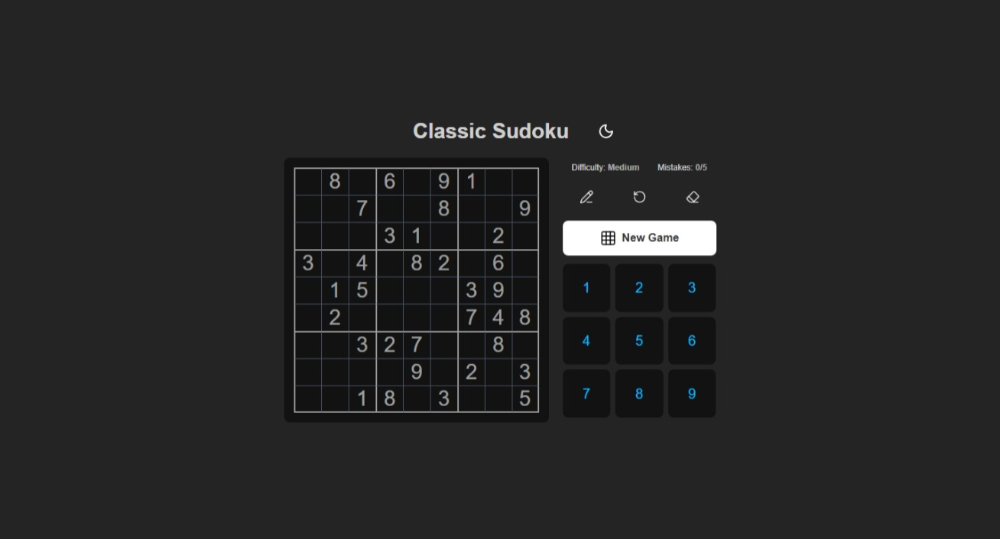
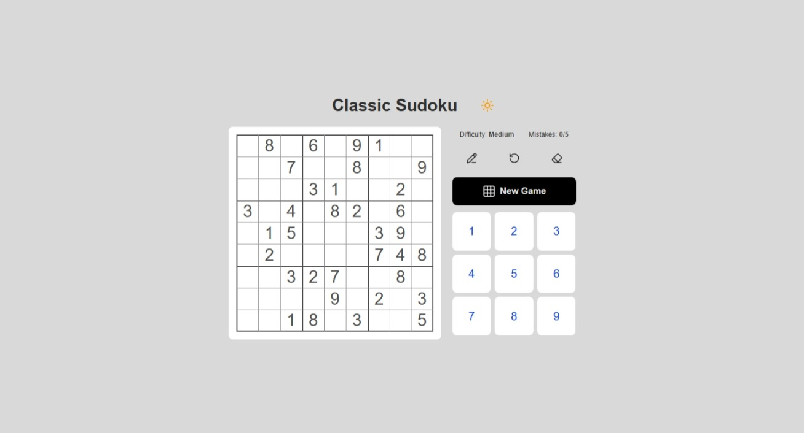

# 🧩 Sudoku Game (React)

A fully interactive **Sudoku puzzle game** built using **React**.  
This project provides a smooth, modern, and intuitive Sudoku experience, allowing users to play, solve, and test their logic skills directly in the browser.

---

## 📸 Preview

**Figure 1:** Sudoku App Dark Theme.

**Figure 2:** Sudoku App Light Theme.

## 🚀 Features

- 🎮 **Playable Sudoku Board** — Interact with a 9×9 grid and fill in numbers.
- ✏️ **Pencil Mode** — Add notes or possible values before committing to a move.
- 🧠 **Validation & Solution Checking** — Get instant feedback for incorrect placements.
- ❌ **Game Over System** — The game ends after **5 mistakes**, encouraging accuracy and focus.
- 🎨 **Light & Dark Mode Themes** — Seamlessly switch between light and dark themes for better comfort and style.
- 📱 **Responsive Design** — Works seamlessly on both desktop and mobile.
- ⌨️ **Keyboard Support:**
  - Input numbers **1–9** directly from your keyboard.
  - Use **Delete** or **Backspace** to erase values.
  - Navigate between cells using **Arrow Keys**.
  - Fully synchronized with the on-screen UI controls.

- 🖱️ **UI Controls** —
  - **Number Buttons** for quick input.
  - **Pencil Mode**, **Erase** and **Reset** buttons for easier gameplay management.

---

## 🛠️ Built With

- **React 19**
- **Vite** — for fast development and build tooling
- **Tailwind CSS** — for styling and theme management
- **Lucide-React** — for modern, lightweight SVG icons used in buttons and UI controls
- **sudoku-api.vercel.app** — for fetching Sudoku puzzles and grid data dynamically
- **JavaScript (ES6+)**
- **React Hooks** — for state and logic management

---
